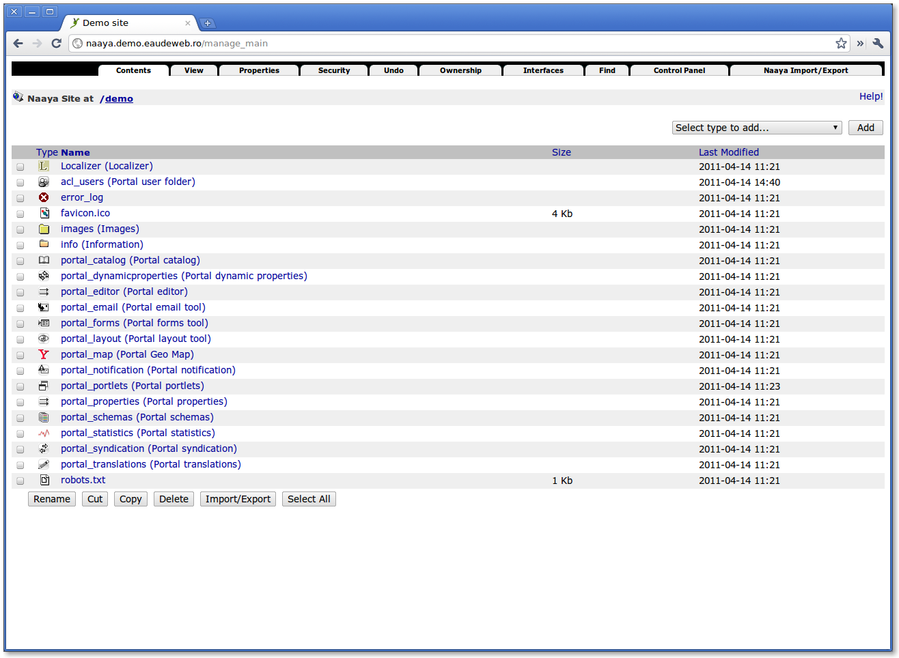

Screenshots
===========

A few screenshots from the front-end, administration section and the :term:`ZMI`.

---------
Front-end
---------

Frontpage
+++++++++

.. image:: ../_static/images/screenshots/frontpage.png
    :width:   500

--------------
Administration
--------------

Administration first page
+++++++++++++++++++++++++

.. image:: ../_static/images/screenshots/admin.png
    :width:   500

User administration
+++++++++++++++++++

.. image:: ../_static/images/screenshots/admin-user.png
    :width:   500

-------------------------------
ZMI - Zope Management Interface
-------------------------------

ZMI dashboard
+++++++++++++

Forms tool
+++++++++++++

.. image:: ../_static/images/screenshots/forms-tool.png
    :width:   500

Customizing a form
++++++++++++++++++

If a form is customized and differs from the one on the disk, then it is saved in the
:term:`ZODB`.

.. image:: ../_static/images/screenshots/forms-customize.png
    :width:   500
