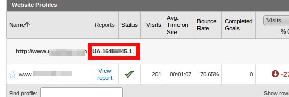

.. _administration-section:

Administration
==============

*Naaya* contains an administration section that can be used by administrators
to manage a Naaya site.

The Administration area (*Portal administration centre*) can be used by
users with the :term:`role` of administrator to make basic maintenance
operations and customizations of their portal. Administrators are intended
to be users with full decisional rights over the content and presentation of
the portal.

After logging in with the proper role, you can reach the Administration area
by selecting the Administration option from the top services links list.
In here, all functionalities are listed in the right-side Administration
portlet. **Add a how-to screenshot here**

Administration sections
--------------------------

The administration area is split into different sections, each used to perform
a set of similar tasks.

-------------------
General settings
-------------------

.. _admin-portal-properties:

Portal properties
+++++++++++++++++++++++
This section is used to manage general administrative tasks concerning
the :term:`portal`. This section is split into a few parts:

* metadata: site title and subtitle, description (which appears on the
  front page of the portal), publisher, contributor, creator, rights

* the two upper logos: for the left and right side of the top banner;
  different logos can be selected for different languages

* email settings: containing the mail server used to send mails, the
  address from which the mails are sent, the list of emails of people that
  want to receive upload notifications and notifications on errors

* glossaries: keywords glossary, a glossary of terms used to index the
  content by filling in the keywords property of each item; coverage glossary,
  containing geographical regions and countries, used to fill in the
  ``geographical coverage`` property of each item

* various other properties relevant for the entire portal, such as: show the release date of items, rename objects' ids, show the number of objects in a folder. 

Portal statistics
+++++++++++++++++++

Here you have access to the statistics provided by Google Analytics for your portal;
visits on a certain range of time, top pages visited, top searches in the
portal, top referrers; the interval between which the portal statistics
should be shown is set here, as well as the default account.

The statistics feature 3 tabs:

* Statistics - view statistics
* Settings - here you can grant access to your account and select websites
* Script and verification

`Script and verification` page features the ability to configure your website
property ID (or UA-number) used by Google Analytics script and the ability
to easily include a meta-verification tag in your pages.
Your website property ID can be found in your Analytics homepage,
above each website record, as you can see in the following image:

Portal layout
+++++++++++++++++

You can choose the layout you prefer for your portal from a set of predefined layouts and colour schemes.

Users' management
+++++++++++++++++++

In this section you can manage your portal users and their roles. See also :doc:`roles`

Translate messages
++++++++++++++++++++

It's the translation centre for the messages across the portal, with the
possibility to individually translate items or import/export all the
translation in CSV, XLIFF and PO formats. See also :doc:`translations`

Lists of links
++++++++++++++++++

Managing the *lists of links* that appear in the header and footer of each page,
and in list of links portlets.

Selection lists
++++++++++++++++++++++

Selection lists appear when adding/editing content types (e.g. when adding an event,
there is a choice asking for the type of event); these choices can be set in
the corresponding selection list.

Notifications
++++++++++++++++++++++++++

Notifications are sent to subscribed users when content iss added or modified in the
portal. There are two types of notifications: notifications for users and notifications for administrators.

Map management
+++++++++++++++++++++++++++

In this section you can manage the settings of the portal map and of the geo-tagged
content, such as map height, choice of map engine, the types of
locations which can be added for geo-taggable objects, as well as the locations.

-----------------------
Content management
-----------------------

Perform administrative tasks concerning various content types.

Manage content types
+++++++++++++++++++++++++

This section exposes all content types available in the portal, allows the
configuration of the content type's properties, and
also allows portals administrators decide whether content types available in
the portal are geo-tagged and ratable.

Basket of approvals
+++++++++++++++++++++++++

This section lists pending (not yet approved) items from the portal.

Basket of translations
+++++++++++++++++++++++++++++

This section lists the portal folders that contain items not yet translated into the
specified language.

Version control
++++++++++++++++++++++++++

It displays a list of all objects checked out for editing by various users

Main sections
++++++++++++++++++++

In this section you can manage the *main sections* that are listed in the left-side portlet. 
The *navigation properties* allows administrators to set the
default style of navigation in the portal; in this respect, they can choose
whether to have an expanded menu (main sections) or not,
as well as to keep it like that, even after a user has clicked on a main
section and has seen its folders and sub-folders and then went to another
main section; the expand levels option allows administrators to specify
the depth of the expanded navigation tree, and the maximum levels option
allows administrators to specify the maximum depth of the navigation tree.

Folder subobjects
++++++++++++++++++++

The subobjects are the content types that a user with publishing rights
is allowed to add inside a folder.
Here you can find the global setting for the allowed
subobjects of folders in portal. However, each folder can be customized,
defining a particular set of types (subobjects) that can be added,
overwriting the default behavior.

------------------
Syndication
------------------

Allows defining and managing local and remote channels in Atom and RDF formats.

Local channels
+++++++++++++++++++++

Remote channels
++++++++++++++++

Lists the remote channels defined by portal administrators; a cron service
updates the feeds four times a day (every 6 hours), and they can also be
manually updated, by pushing the *Update now* button

Remote channels aggregators
++++++++++++++++++++++++++++++++

They can be defined by the portal administrator and are collections of remote
channels that contain all the data from the channels defined in the
*Remote channels* section

------------
Portlets
------------

Define, edit or delete them and arrange existing portlets around the pages. See also :doc:`portlets`
