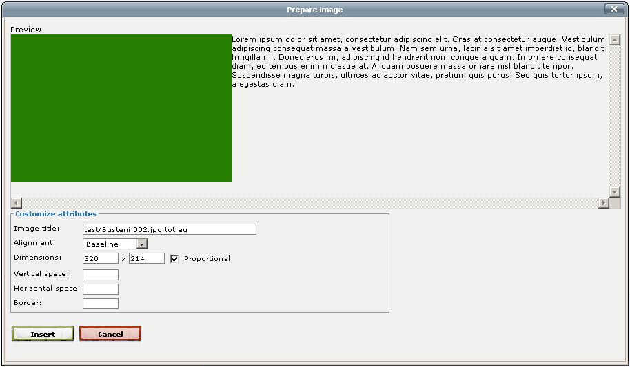

Editor Tool
===========

.. automodule:: Products.NaayaCore.EditorTool.EditorTool
    :members:
      loadConfig

.. autoclass:: Products.NaayaCore.EditorTool.EditorTool.EditorTool
    :members:

Image upload interface
----------------------

The Editor Tool makes it easy to add images. To insert an image from a
Photo Album click the insert image button. This will open the Select image
popup. Select the album you want from the list. For example:

.. image:: images/select_image.gif

You can filter the images using the search below the list of albums.
This searches words in the current site language from the title, author,
source and description of the images in the current selected album.
Select an image by clicking it.

The Select image size will open. This allows you to select the dimensions
for the image. For example:

.. image:: images/select_image_size.gif

Next, the Prepare image page opens. Some of the properties for the image
are already inserted. For example the title is set to be a concatenation of
the image title, author and source. For example:

